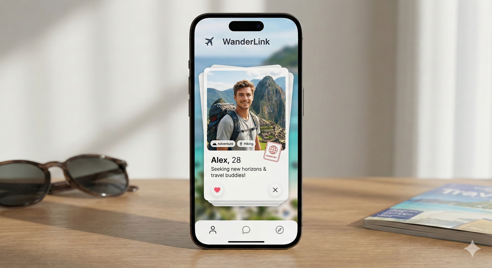

# 🌍 Travel Tinder - Connect with Fellow Adventurers

<div align="center">



**A modern swipe-based travel matching app that connects like-minded travelers for unforgettable adventures**

[](https://flutter.dev)
[](https://dart.dev)
[](LICENSE)

[Features](#-features) • [Getting Started](#-getting-started) • [Screenshots](#-screenshots) • [Tech Stack](#-tech-stack)

</div>

---

## ✨ Features

- **🔥 Tinder-Style Matching** - Swipe left to skip, right to like, and super like for favorites
- **👥 Find Travel Buddies** - Connect with verified travelers who share your interests
- **🗺️ Explore Trips** - Discover amazing destinations and planned trips from the community
- **🎯 Smart Matching** - Get matched based on travel style, budget, dates, and interests
- **⭐ User Ratings** - See verified reviews and ratings from other travelers
- **🔒 Verified Profiles** - Trust and safety with verified user accounts
- **💬 In-App Messaging** - Chat directly with matched travelers
- **🌍 Global Community** - Connect with travelers from around the world
- **📱 Responsive Design** - Beautiful UI optimized for all devices

## 🎯 Why Travel Tinder?

Traveling alone isn't always fun or safe. Travel Tinder solves the problem by:

- **Safety First**: Connect only with verified travelers
- **Shared Interests**: Match based on travel style, activities, and budget
- **Cost Effective**: Split accommodation and transport costs with travel buddies
- **Authentic Experiences**: Meet locals and genuine travelers, not just tourists
- **Community Driven**: Build lasting friendships and travel memories

## 📱 Key Screens

### Home Screen
- Discover featured trips from the community
- Browse by category (Adventure, Beach, Culture, Food)
- Quick access to all main features

### Discover Section
- Browse available trips with detailed information
- Filter by destination, budget, and dates
- View ratings and traveler reviews

### Find Buddies
- Swipe through traveler profiles
- Match with compatible travel companions
- View verified badges and user ratings
- Join travel groups

### Profile Section
- Customize your travel profile
- Set interests and travel preferences
- View your trip history and matches
- Manage your verified status

## 🚀 Getting Started

### Prerequisites
- Flutter SDK: >=3.10.0
- Dart SDK: >=3.10.0
- Android SDK / Xcode (for mobile development)

### Installation

1. **Clone the repository**
   ```bash
   git clone https://github.com/yourusername/travel_tinder.git
   cd travel_tinder
   ```

2. **Install dependencies**
   ```bash
   flutter pub get
   ```

3. **Run the app**
   ```bash
   flutter run
   ```

### Configuration

Configure your app settings in `lib/theme/app_theme.dart`:
- Customize colors and branding
- Adjust spacing and border radius
- Modify fonts and text styles

## 📸 Screenshots

| Discover Trips | Find Buddies | Swipe Match | User Profile |
|---|---|---|---|
| Browse featured trips and categories | Find travel buddies globally | Swipe to match with travelers | Complete profile management |

## 🏗️ Project Structure

```
lib/
├── main.dart                 # App entry point
├── models/                   # Data models
│   ├── profile_model.dart
│   └── trip_model_enhanced.dart
├── screens/                  # App screens
│   ├── home_screen.dart
│   ├── travel_match_screen.dart
│   └── find_buddies_screen.dart
├── widgets/                  # Reusable components
│   └── reusable_widgets.dart
└── theme/                    # App theming
    └── app_theme.dart
```

## 🛠️ Tech Stack

- **Frontend Framework**: Flutter 3.10+
- **Language**: Dart 3.10+
- **State Management**: Provider (recommended)
- **UI Components**:
  - swipe_cards: Card swiping functionality
  - image_picker: Photo selection
  - cached_network_image: Efficient image loading
- **Design System**: Custom Material Design 3
- **Architecture**: Clean Architecture with separation of concerns

## 🎨 Design

- **Color Scheme**: Modern and vibrant (Primary: #FF6B6B, Secondary: #4ECDC4)
- **Typography**: Poppins (body), Playfair (headers)
- **Animations**: Smooth transitions and swipe feedback
- **Responsive**: Adapts to all screen sizes

## 📊 Key Statistics

- **Users Worldwide**: Connect with global travelers
- **Verified Profiles**: Trust and safety first
- **Trip Categories**: 20+ destination types
- **Success Rate**: High match compatibility

## 🚧 Roadmap

- [x] Core swiping functionality
- [x] User profiles and matching
- [x] Trip discovery and filtering
- [ ] In-app messaging system
- [ ] Payment integration for shared costs
- [ ] User reviews and ratings
- [ ] Trip booking and management
- [ ] Video verification
- [ ] Insurance and safety features
- [ ] Social sharing

## 🤝 Contributing

We love contributions! Here's how you can help:

1. **Fork** the repository
2. **Create** your feature branch (`git checkout -b feature/amazing-feature`)
3. **Commit** your changes (`git commit -m 'Add amazing feature'`)
4. **Push** to the branch (`git push origin feature/amazing-feature`)
5. **Open** a Pull Request

### Contribution Guidelines
- Follow Flutter best practices
- Add comments for complex logic
- Test thoroughly before submitting
- Update documentation as needed

## 🐛 Bug Reports

Found a bug? Please create an issue with:
- Clear description of the problem
- Steps to reproduce
- Expected vs actual behavior
- Screenshots or videos if applicable

## 💡 Feature Requests

Have an idea? We'd love to hear it! Create an issue describing:
- The problem your feature solves
- How it benefits users
- Any mockups or examples

## 📄 License

This project is licensed under the MIT License - see the [LICENSE](LICENSE) file for details.

## 👥 Authors

- **Your Name** - *Initial work* - [GitHub](https://github.com/yourusername)

## 🙏 Acknowledgments

- Flutter and Dart communities for excellent documentation
- Open source package maintainers
- Beta testers and early users for valuable feedback
- All contributors who help improve this project

## 📞 Support

Have questions? Reach out to us:
- 📧 Email: support@traveltinder.com
- 💬 Discord: [Join our community](https://discord.gg/)
- 🐦 Twitter: [@TravelTinder](https://twitter.com/)
- 🌐 Website: [traveltinder.com](https://traveltinder.com)

## 🌟 Show Your Support

If you like this project, please give it a star! ⭐

It really helps us grow and motivates us to build amazing features!

```
     ⭐
    ⭐⭐⭐
   ⭐⭐⭐⭐⭐
  Travel Tinder
```

---

**Made with ❤️ by travelers, for travelers**
